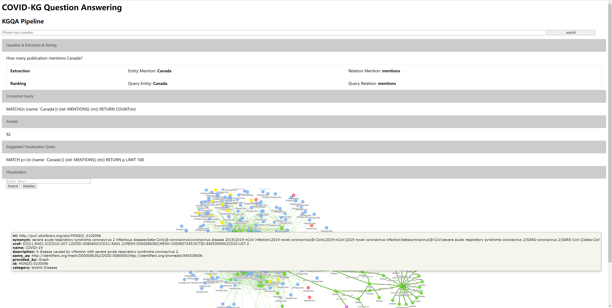

KGQA-COVID
=========================================================================================
This repo is extended from  `kg-covid-19 <https://github.com/Knowledge-Graph-Hub/kg-covid-19/>`_.

Preparation
----------------------------------------------
1. Please follow the instructions of `original repo <https://github.com/Knowledge-Graph-Hub/kg-covid-19/>`_ to download and process the corresponding data.

2. Install the requirements: pip install -r requirements.txt

3. Install `OpenIE <https://github.com/dair-iitd/OpenIE-standalone>`_.
4. Install `Neo4j <https://neo4j.com/docs/operations-manual/current/installation/>`_ (Optional) Or you can use Neo4j SandboX or AuraDB online.

5. Upload the data to Neo4j Graph Database.

Launching the Web Demo
----------------------------------------------
run python app.py under flask directory after launching OpenIE and Neo4j database to play with the KGQA demo.

